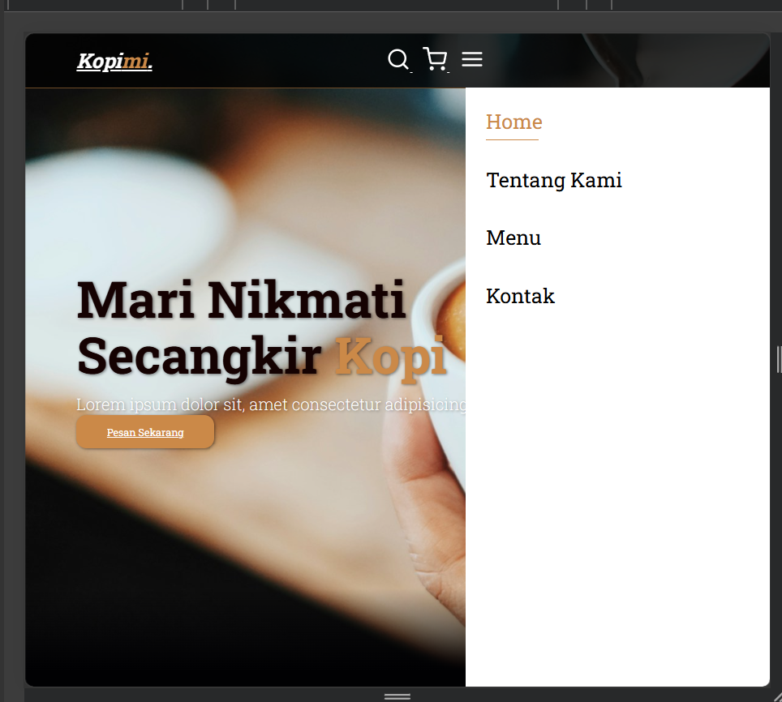

# Kopimi - Nikmati Secangkir Kopi

## Tentang Proyek
Website Kopimi adalah platform modern untuk menikmati kopi dengan cita rasa lokal yang sudah terintegrasi dengan database MySQL. Proyek ini dikembangkan sebagai bagian dari tugas mata kuliah Teknik Informatika.

### Fitur Utama
- **Menu Dinamis**: Mengambil data langsung dari database `kopimi_db`.
- **Form Kontak**: Menyimpan pesan pengunjung (nama, email, pesan) ke tabel kontak.
- **Responsif**: Tampilan optimal di berbagai perangkat melalui media queries CSS.

### Teknologi yang Digunakan
- **Backend**: `PHP` & `MySQL` (MariaDB).
- **Frontend**: `HTML5`, `CSS3`, & `JavaScript`.
- **Icons**: `Feather Icons`.

### Cara Instalasi
1. **Clone repositori**: `git clone https://github.com/JordanPole12/Tugas-Awam.git`
2. **Database**: Impor file database ke phpMyAdmin dengan nama `kopimi_db`.
3. **Konfigurasi**: Pastikan file `koneksi.php` sudah mengarah ke database yang benar.
4. **Jalankan**: Gunakan Localhost (XAMPP/Laragon) untuk mengakses `index.php`.
